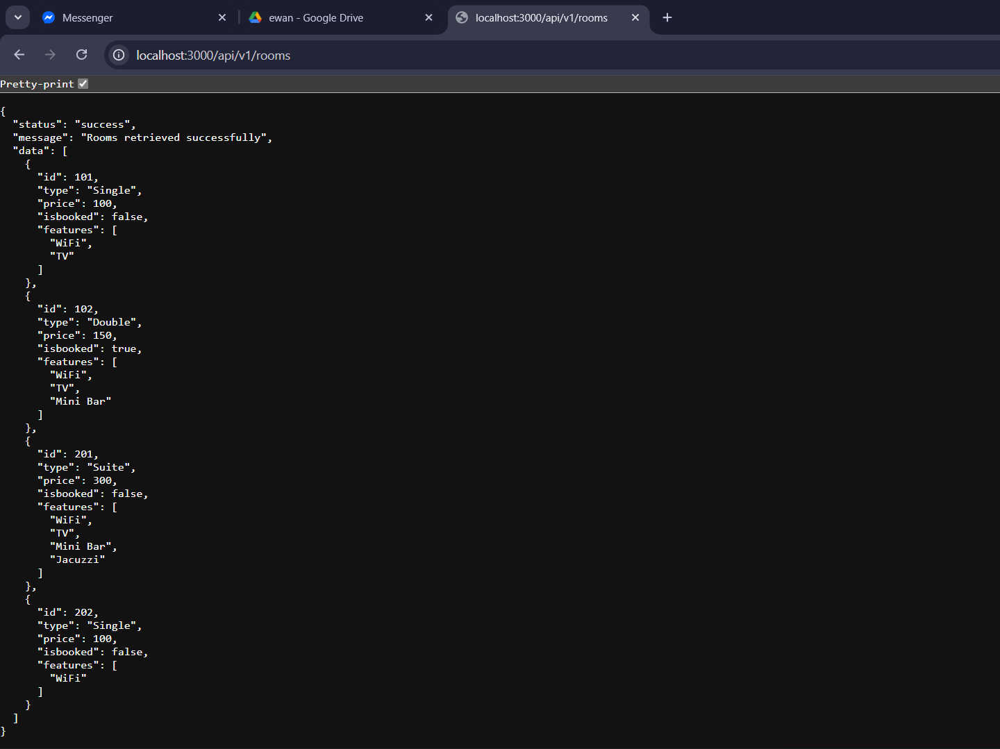

## README.md

## RESTful API Activity – Angel Rose Dela Torre

### Best Practices Implementation

---

### 1. Environment Variables

**Why did we put BASE_URI in .env instead of hardcoding it?**

*Answer:*
We placed BASE_URI in the .env file to avoid hardcoding values inside the source code. This improves security and makes the application easier to maintain. If the base URL changes (for example, from development to production), we can update it in the .env file without modifying the code itself.

---

### 2. Resource Modeling

**Why did we use plural nouns (e.g., /dishes) for our routes?**

*Answer:*
We used plural nouns like /dishes because the endpoint represents a collection of dish resources. Each dish is an individual item within this collection, which can be accessed using /dishes/:id. This follows RESTful API standards and makes the API structure clear and consistent.

---

### 3. Status Codes

**When do we use 201 Created vs 200 OK?**

*Answer:*
201 Created is used when a new dish is successfully added to the system using a POST request.
200 OK is used when a request is successful but does not create a new resource, such as retrieving dishes with a GET request, updating a dish, or deleting a dish.

---

-Why is it important to return 404 instead of just an empty array or a generic error?

*Answer:*
Returning a 404 Not Found status code clearly indicates that the requested dish does not exist. This is important because it provides accurate feedback to the client, improves error handling, and follows proper HTTP standards instead of returning misleading or unclear responses.

---

### 4. Testing

# delatorre-api-activity
